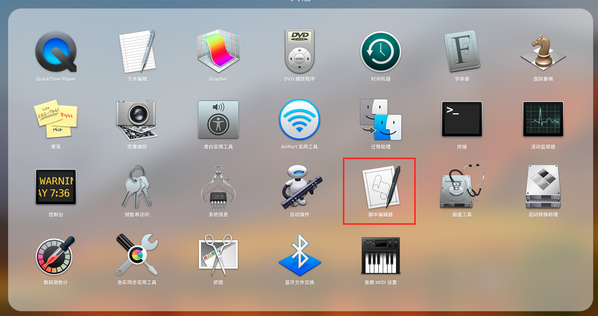
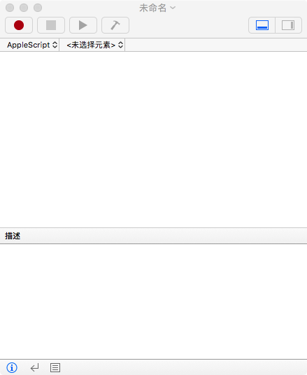

## 初始 AppleScript


首先了解一下 Apple 公司创造 AppleScript 的初衷，它是用来编写运行于mac的脚本的。重要的是它是 mac 上操作应用程序为数不多的途径之一。非常方便实现一些平常工作中重复工作的脚本化，提升工作效率，避免重复劳动。

### AppleScript 有啥用？

-----------------

- 可以用来书写脚本直接生成脚本文件(.scpt)、App 文件；

- 可以用来编写 Cocoa App（也可以创建 Automation Action）；

- 可以在 Alfred.app 和 Autormator.app 中使用；

- 可以非常方便的在 Shell 和 OC 中调用执行；


### AppleScript 编辑器

-----------------

MacOS 上有自带的脚本编辑器，目前支持 AppleScript 和 JavaScript。
其中有模版工程、模版代码、应用词典等功能，极大方便了 AppleScript/JavaScript 脚本的编写。





### 基础语法

-----------------

- 基本数据类型

  > AppleScript有4种最基本的数据类型：number、string、list和record，分别对应编程概念中的数值、字符串、数组和字典。

  - number 类型

    ```AppleScript
    set x to 2
    get x
    set y to 3
    get y
    set xy to x * y
    set x3 to y ^ 3
    ```

  - string 类型

    ```AppleScript
    set strX to "Hello "
    set strY to "AppleScript"
    
    -- 字符串拼接
    set strXY to strX & strY
    -- 获取字符串长度
    set lengthOfStrXY to the length of strXY
    
    -- 分割成单个字符并组成一个新的列表
    set charList to every character of strXY
    
    -- 通过 AppleScript's text item delimiters 来指定分隔号，然后通过 every text item of 来实现分割
    set defaultDelimiters to AppleScript's text item delimiters
    set AppleScript's text item delimiters to " "
    set listAfterDelimiter to every text item of strXY
    set AppleScript's text item delimiters to defaultDelimiters
    
    
    -- number 与 string 类型转换
    set numberToString to 100 as string
    set stringToNumber to "1234" as number
    ```

  - list 类型

    ```AppleScript
    set firstList to { 100, 200.0, "djfif", -10 }
    set emptyList to {}
    set currentList to { 2, 3, 4, 5 }
    
    -- 列表拼接
    set modifiedList to firstList & emptyList & currentList
    
    -- 获取和更改列表中的元素
    set item 2 of modifiedList to "2"
    get modifiedList
    set the third item of modifiedList to "abcde"
    get modifiedList
    
    -- 用列表中的随机元素赋值
    set randomX to some item of modifiedList
    
    -- 获取最后一个元素
    set lastItem to the last item of modifiedList
    
    -- 负数表示从列表尾端开始获取元素
    set aLastItem to item -2 of modifiedList
    
    -- 获取第一个元素
    set firstItem to the first item of modifiedList
    
    set longList to { 1,2,3,4,5,6,7,8,9,10 }
    set shortList to items 6 through 8 of longList
    
    -- 逆向获取子列表
    set reversedList to reverse of longList
    set listCount to the count of longList
    set the end of longList to 5
    get longList
    
    -- 将 string 转换为 list
    set string1 to "string1"
    set stringList to string1 as list
    
    -- 可以用&将字符串和列表连接起来，结果取决于&前面的变量
    set strAndList to string1 & stringList
    ```

  - record 类型

    ```AppleScript
    set aRecord to { name1:100, name2:"This is a record"}
    set valueOfName1 to the name1 of aRecord
    
    set newRecord to { name1:name1 of aRecord }
    
    set numberOfProperties to the count of aRecord
    ```

- 条件/循环

  ```AppleScript
  set x to 500
  
  if x > 100 then
  	display alert "x > 100"
  else if x > 10 then
      display alert "x > 10"
  else
      display alert "x <= 10"
  end if
  
  
  set sum to 0
  set i to 0
  repeat 100 times
      set i to i + 1
      set sum to sum + i
  end repeat
  get sum
  
  
  repeat with counter from 0 to 10 by 2
      display dialog counter
  end repeat
  
  set counter to 0
  set listToSet to {}
  -- 注意下这个 ≠ 符号是使用 Option+= 输入的
  repeat while counter ≠ 10
  	-- display dialog counter as string
  	set listToSet to listToSet & counter
  	set counter to counter + 2
  end repeat
  get listToSet
  
  set counter to 0
  set listToSet to {}
  repeat until counter = 10
      -- display dialog counter as string
      set listToSet to listToSet & counter
      set counter to counter + 2
  end repeat
  get listToSet
  
  set aList to { 1, 2, 8 }
  repeat with anItem in aList
      display dialog anItem as string
  end repeat
  ```

- 注释

  ```AppleScript
  -- 这是单行的注释
  
  (*
  这是多行的注释
  这是多行的注释
  *)
  ```

- 函数

  ```AppleScript
  on showAlert(alertStr)
  	display alert alertStr buttons {"I know", "Cancel"} default button "I know"
  end showAlert
  
  showAlert("hello world")
  ```

- 换行

  ```AppleScript
  -- 键盘使用组合键 Option+L 输入'¬' 可以实现代码折行
  on showAlert(alertStr)
  	display alert alertStr ¬
  		buttons {"I know", "Cancel"} default button "I know"
  end showAlert
  
  showAlert("hello world")
  ```

- 使用AppleScript中的对话框

  > 使用弹出框有一些要注意的地方:
  >
  > * 1.它可以有多个按钮的;
  > * 2.它是有返回值的,返回值是你最终操作的字符串;
  > * 3.它是可以增加输入框的，而且比你想的简单多了;

  ```AppleScript
  set dialogString to "Input a number here"
  set returnedString to display dialog dialogString default answer ""
  get returnedString
  //{button returned:"好", text returned:"asdf"}
  
  set dialogString to "Input a number here"
  set returnedString to display dialog dialogString default answer ""
  set returnedNumber to the text returned of returnedString
  try
  	set returnedNumber to returnedNumber as number
  	set calNumber to returnedNumber * 100
  	display dialog calNumber
  on error the error_message number the error_number
  	display dialog "Error:" & the error_number & " Details:" & the error_message
  end try
  
  beep
  ```

- 预定义变量

  > 就是一些特殊的关键字，类似于其他语言中的 self、return等，有固定的含义；
  >
  > 千万不要用它来自定义变量。

  - **result**：记录最近一个命令执行的结果，如果命令没有结果，那么将会得到错误

  - **it**：指代最近的一个 tell 对象

  - **me**：这指代段脚本。用法举例 path to me 返回本脚本所在绝对路径

  - **tab**：用于string，一个制表位

  - **return**：用于string，一个换行

- 字符串比较：Considering/Ignoring语句

  在 AppleScript 的字符串比较方式中，你可以设定比较的方式：上面 considering 和 ignoring 含义都是清晰的，一个用于加上xx特征，一个用于忽略某个特征；一个特征就是一个attribute。
  atrribute应该为列表中的任意一个:

  - **case** 大小写
  - **diacriticals** 字母变调符号(如e和é)
  - **hyphens** 连字符(-)
  - **numeric strings** 数字化字符串(默认是忽略的)，用于比较版本号时启用它。
  - **punctuation** 标点符号(,.?!等等,包括中文标点)
  - **white space** 空格

      ```AppleScript
      ignoring case
        if "AAA" = "aaa" then
            display alert "AAA equal aaa when ignoring case"
        end if
      end ignoring
      
      considering numeric strings
        if "10.3" > "9.3" then
            display alert "10.3 > 9.3"
        end if
      end considering
      ```

- 列表选择对话框

  ```
  display alert "这是一个警告" message "这是警告的内容" as warning
  
  choose from list {"选项1", "选项2", "选项3"} with title "选择框" with prompt "请选择选项"
  ```

  选择框有以下参数:

  - 直接参数 紧跟list类型参数，包含所有备选项
  - **title** 紧跟text，指定对话框的标题
  - **prompt** 紧跟text，指定提示信息
  - **default items** 紧跟list，指定默认选择的项目
  - **empty selection allowed** 后紧跟true表示允许不选
  - **multiple selections allowed** 后紧跟true表示允许多选

- 文件选择对话框

  ```AppleScript
  -- 选取文件名称Choose File Name
  choose file name with prompt "指定提示信息"
  
  -- 选取文件夹Choose Folder
  choose folder with prompt "指定提示信息" default location file "Macintosh HD:Users" with invisibles, multiple selections allowed and showing package contents
  
  -- 选取文件Choose File
  choose file of type {"txt"}
  ```

- 文件读取和写入

  > 文件读取用read，允许直接读取；
  >
  > 但是写入文件之前必须先打开文件，打开文件是open for access FileName；
  >
  > 写入文件用write...to语句；
  >
  > 最后记得关闭文件close access filePoint

  ```AppleScript
  set myFile to alias "Macintosh HD:Users:xiaxuqiang:Desktop:example.txt"
  read myFile
  set aFile to alias "Macintosh HD:Users:xiaxuqiang:Desktop:example.txt"
  set fp to open for access aFile with write permission
  write "AppleScript写入文本" to fp
  close access fp
  
  
  --在桌面上创建一个文件,内部包含一个txt文件,并向txt内插入文件
  on createMyTxt()
  	tell application "Finder"
  		make new folder at desktop with properties {name:"star"}
  		make new file at folder "star" of desktop with properties {name:"star.txt"}
  	end tell
  end createMyTxt
  
  --向txt文件内写入内容
  on writeTextToFile()
  	set txtFile to alias "Macintosh HD:Users:xiaxuqiang:Desktop:star:star.txt"
  	set fp to open for access txtFile with write permission
  	write "你好,这是一个txt文件" to fp as «class utf8»
  	close access fp
  end writeTextToFile
  
  createMyTxt()
  
  writeTextToFile()
  
  
  ```

- 其它语法

  上面的例子只是苹果官方文档的精简入门版，还有语言的面相对象特征，此处不再展开。

  AppleScript 中还有比较丰富的其它 Command 集合，此处也不再一一列举。

### 案例列举

----------
- 使用 mac 的邮件系统

  ```AppleScript
  --Variables
  set recipientName to " 小红"
  set recipientAddress to "aliyunzixun@xxx.com"
  set theSubject to "AppleScript Automated Email"
  set theContent to "This email was created and sent using AppleScript!"
  --Mail Tell Block
  tell application "Mail"
  	--Create the message
  	set theMessage to make new outgoing message with properties {subject:theSubject, content:theContent, visible:true}
  	--Set a recipient
  	tell theMessage
  		make new to recipient with properties {name:recipientName, address:recipientAddress}
  		--Send the Message
  		send
  	end tell
  end tell
  ```

- 让浏览器打开网页

  ```AppleScript
  set urlMyBlog to "https://blog.csdn.net/sodaslay"
  set urlChinaSearch to "http://www.chinaso.com"
  set urlBiying to "https://cn.bing.com"
  
  --使用Chrome浏览器
  tell application "Google Chrome"
  	--新建一个chrome窗口
  	set window1 to make new window
  	tell window1
  		--当前标签页加载必应,就是不用百度哈哈
  		set currTab to active tab of window1
  		set URL of currTab to urlBiying
  		--打开csdn博客,搜索
  		make new tab with properties {URL:urlMyBlog}
  		make new tab with properties {URL:urlChinaSearch}
  		--将焦点由最后一个打开的标签页还给首个标签页
  		set active tab index of window1 to 1
  	end tell
  end tell
  
  ```

- 让你的电脑说话

  ```AppleScript
  -- You can use any of the voices from the System Voice pop-up on the Text to Speech tab in the Speech preferences pane.
  -- Default Value:
  -- The current System Voice (set in the Speech panel in System Preferences.
  
  tell current application
  	say "My name is LiMei. Nice to meet you. How are you?" using "Veena"
  	say "Fine, thanks. And you?" using "Victoria"
  	say "滚"
  	say "我跟你说" using "Sin-Ji"
  end tell
  
  beep
  ```

- 调用 mac 的通知中心

  > crontab + AppleScript + 通知中心 可以做很多定制的提醒工具

  ```AppleScript
  display notification "message" with title "title" subtitle "subtitle"
  
  display notification "message" sound name "Bottle.aiff"
  -- 声音文件都在 ~/Library/Sounds 和 /System/Library/Sounds 下面
  ```

- 清理废纸篓

  ```AppleScript
  tell application "Finder"
  	empty the trash
  	beep
  	-- 打开启动磁盘
  	open the startup disk
  end tell
  ```

- 模拟键盘按键消息

  ```AppleScript
  launch application "System Events"
  launch application "TextMate"
  tell application "System Events"
  	set frontmost of process "TextMate" to true
  	keystroke "input string from applescript"
  	keystroke "a" using command down
  	keystroke "c" using command down
  	keystroke "a" using command down
  	key code 124 using command down
  	keystroke "
  "
  	keystroke "v" using command down
  end tell
  ```

  > 其中 using command 可以使用组合，例如：key code 53 using {command down, option down}
  >
  > 其中的 key code 对照表如下

  ```
  apple key code list:
  
  0 0x00 ANSI_A
  1 0x01 ANSI_S
  2 0x02 ANSI_D
  3 0x03 ANSI_F
  4 0x04 ANSI_H
  5 0x05 ANSI_G
  6 0x06 ANSI_Z
  7 0x07 ANSI_X
  8 0x08 ANSI_C
  9 0x09 ANSI_V
  10 0x0A ISO_Section
  11 0x0B ANSI_B
  12 0x0C ANSI_Q
  13 0x0D ANSI_W
  14 0x0E ANSI_E
  15 0x0F ANSI_R
  16 0x10 ANSI_Y
  17 0x11 ANSI_T
  18 0x12 ANSI_1
  19 0x13 ANSI_2
  20 0x14 ANSI_3
  21 0x15 ANSI_4
  22 0x16 ANSI_6
  23 0x17 ANSI_5
  24 0x18 ANSI_Equal
  25 0x19 ANSI_9
  26 0x1A ANSI_7
  27 0x1B ANSI_Minus
  28 0x1C ANSI_8
  29 0x1D ANSI_0
  30 0x1E ANSI_RightBracket
  31 0x1F ANSI_O
  32 0x20 ANSI_U
  33 0x21 ANSI_LeftBracket
  34 0x22 ANSI_I
  35 0x23 ANSI_P
  36 0x24 Return
  37 0x25 ANSI_L
  38 0x26 ANSI_J
  39 0x27 ANSI_Quote
  40 0x28 ANSI_K
  41 0x29 ANSI_Semicolon
  42 0x2A ANSI_Backslash
  43 0x2B ANSI_Comma
  44 0x2C ANSI_Slash
  45 0x2D ANSI_N
  46 0x2E ANSI_M
  47 0x2F ANSI_Period
  48 0x30 Tab
  49 0x31 Space
  50 0x32 ANSI_Grave
  51 0x33 Delete
  53 0x35 Escape
  55 0x37 Command
  56 0x38 Shift
  57 0x39 CapsLock
  58 0x3A Option
  59 0x3B Control
  60 0x3C RightShift
  61 0x3D RightOption
  62 0x3E RightControl
  63 0x3F Function
  64 0x40 F17
  65 0x41 ANSI_KeypadDecimal
  67 0x43 ANSI_KeypadMultiply
  69 0x45 ANSI_KeypadPlus
  71 0x47 ANSI_KeypadClear
  72 0x48 VolumeUp
  73 0x49 VolumeDown
  74 0x4A Mute
  75 0x4B ANSI_KeypadDivide
  76 0x4C ANSI_KeypadEnter
  78 0x4E ANSI_KeypadMinus
  79 0x4F F18
  80 0x50 F19
  81 0x51 ANSI_KeypadEquals
  82 0x52 ANSI_Keypad0
  83 0x53 ANSI_Keypad1
  84 0x54 ANSI_Keypad2
  85 0x55 ANSI_Keypad3
  86 0x56 ANSI_Keypad4
  87 0x57 ANSI_Keypad5
  88 0x58 ANSI_Keypad6
  89 0x59 ANSI_Keypad7
  90 0x5A F20
  91 0x5B ANSI_Keypad8
  92 0x5C ANSI_Keypad9
  93 0x5D JIS_Yen
  94 0x5E JIS_Underscore
  95 0x5F JIS_KeypadComma
  96 0x60 F5
  97 0x61 F6
  98 0x62 F7
  99 0x63 F3
  100 0x64 F8
  101 0x65 F9
  102 0x66 JIS_Eisu
  103 0x67 F11
  104 0x68 JIS_Kana
  105 0x69 F13
  106 0x6A F16
  107 0x6B F14
  109 0x6D F10
  111 0x6F F12
  113 0x71 F15
  114 0x72 Help
  115 0x73 Home
  116 0x74 PageUp
  117 0x75 ForwardDelete
  118 0x76 F4
  119 0x77 End
  120 0x78 F2
  121 0x79 PageDown
  122 0x7A F1
  123 0x7B LeftArrow
  124 0x7C RightArrow
  125 0x7D DownArrow
  126 0x7E UpArrow
  ```

- 切换程序前台、设置焦点窗口

  ```AppleScript
  -- 前提是当前 iTerm app 中打开了两个窗口，其中有个窗口名字叫 "2. bash" 并且该窗口中第一个 tab 中含有三个 session，本脚本的作用是让 "2. bash" 窗口中第一个 tab 中的第三个 session 变为焦点。
  tell the application "iTerm"
  	activate
  	
  	set theWindow to the first item of ¬
  		(get the windows whose name is "2. bash")
  	if index of theWindow is not 1 then
  		set index of theWindow to 1
  		
  		set visible of theWindow to false
  		set visible of theWindow to true
  	end if
  	
  	tell theWindow
  		set theTab to the first item of theWindow's tabs
  		
  		select theTab
  		
  		select the third session of theTab
  	end tell
  end tell
  ```

  ```AppleScript
  -- 下面是上面的逻辑的另一种实现
  tell the application "iTerm"
  	activate
  	
  	set theWindow to the first item of ¬
  		(get the windows whose name is "2. bash")
  	if the index of theWindow is not 1 then
  		set the index of theWindow to 2
  		tell application "System Events" to ¬
  			tell application process "iTerm2" to ¬
  				keystroke "`" using command down
  	end if
  end tell
  ```

- 粘贴板操作

  ```AppleScript
  set the clipboard to "Add this sentence at the end."
  tell application "TextEdit"
  	activate --make sure TextEdit is running
  	make new paragraph at end of document 1 with data (return & (the clipboard))
  end tell
  ```


  上面的例子都是一些比较简单的例子，还有很多有趣的例子可以自己根据需要，查询词典中涉及到的 App 的 AppleScript 接口自己做实现。关于如何使用 App 的 AppleScript 的词典，建议阅读[Mac 的自动化 AppleScript 终极入门手册](https://wenku.baidu.com/view/41c783c3aa00b52acfc7ca09.html)

###  何时使用？

-------

- 一些跨应用的重复操作步骤使用 AppleScript/JavaScript 实现关键步骤
- 结合 Alread.app、Automator.app、crontab 等实现一些场景的触发调用
- 本地的一些工具脚本可以直接调用 AppleScript 做一些简单的输入、弹框、通知交互
- 用 AppleScript 写一个 CocoaApp 或者 Automator Action（**但是可以用 Objective-C 我们就没必要使用相对不熟悉的 AppleScript**）
- OC 的命令行工程可以借助 NSAppleScript 操作其它应用
- CocoaApp 工程可以通过 XPCService+ScriptingBridge+AppleScript(OC版本接口调用)启动其它应用([样例工程](https://github.com/BenXia/AppleScriptStudy/tree/master/5_快发邮件OC版本))


### 生成 Cocoa App 的 OC 接口文件
-----------------
> 需要通过 OC 调用系统中某个 App 的接口，可以参照如下命令行导出其 .h 文件

```Shell
sdef /Applications/Mail.app | sdp -fh -o ~/Desktop --basename Mail --bundleid `defaults read "/Applications/Mail.app/Contents/Info" CFBundleIdentifier`
```


### 更多资料

-----------------

[AppleScript Language Guide 官方文档](https://developer.apple.com/library/archive/documentation/AppleScript/Conceptual/AppleScriptLangGuide/introduction/ASLR_intro.html)

[Mac Automation Scripting Guide](https://developer.apple.com/library/archive/documentation/LanguagesUtilities/Conceptual/MacAutomationScriptingGuide/MakeaSystem-WideService.html#//apple_ref/doc/uid/TP40016239-CH46-SW1)

[AppleScript 与 Shell 的互相调用](https://support.apple.com/zh-cn/guide/terminal/trml1003/mac)

[Objective-C 运行 AppleScript 脚本](https://blog.csdn.net/SysProgram/article/details/46817917)

[如何让 Cocoa App 支持 AppleScript ](https://www.aliyun.com/jiaocheng/376240.html?spm=5176.100033.2.11.2a7d9a70mlzSWR)

[AppleScript for Absolute Starters](http://www.docin.com/p-515251458.html)

[Apple Automator with AppleScript](http://ishare.iask.sina.com.cn/f/33325750.html)

[JavaScript for Automation](https://developer.apple.com/library/archive/releasenotes/InterapplicationCommunication/RN-JavaScriptForAutomation/Articles/Introduction.html#//apple_ref/doc/uid/TP40014508-CH111-SW1)

[JXA-Cookbook](https://github.com/JXA-Cookbook/JXA-Cookbook/wiki/Foreword)

